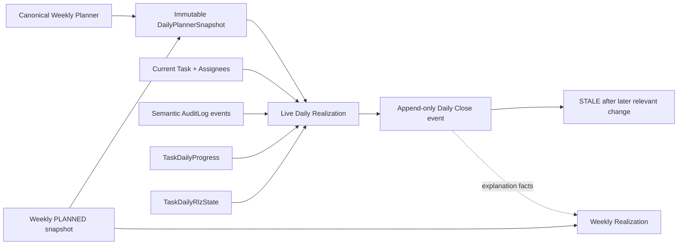

# REALIZIMI DITOR

## 1. Purpose

Daily Realization answers what was planned for each employee, what was completed, what changed, why work remained unfinished, and how much of the original daily plan was realized. It extends the existing Realization domain; it is not a parallel reporting system.

## 2. Business definitions

- **Weekly original plan**: the official `WeeklyPlannerSnapshot` of type `PLANNED`. Weekly Realization continues to use it.
- **Daily operational baseline**: the immutable department/day plan captured from the live canonical Planner before the day's first relevant mutation.
- **Live realization**: baseline + semantic task events + current task/progress/RLZ state.
- **Additional work**: work outside the employee's daily baseline. It never increases raw plan realization.
- **Daily Close**: an append-only factual snapshot. Later changes make it stale; they do not rewrite it.

## 3. Architecture

## 4. Daily baseline

`daily_planner_snapshots` has one row per `(department_id, day_date)`. Its JSON payload stores canonical task identity, employee ownership, occurrence date, AM/PM/ALL slot, source, project, due date, and status at capture. The row is never updated. A PostgreSQL `ON CONFLICT DO NOTHING` insert makes concurrent creation idempotent.

The normal capture is Celery Beat at `REALIZATION_BASELINE_HOUR:REALIZATION_BASELINE_MINUTE` in the configured scheduler timezone. The task mutation routes call the same ensure service before the current local workday's first mutation. Past/future dates are not reconstructed by this fallback.

## 5. Relationship with Weekly Planner

The baseline calls the existing `_build_weekly_snapshot_payload` and reduces its canonical `task_items/occurrences`; it does not query `Task.due_date == day`. Therefore planner rules remain authoritative for recurring occurrences, project/fast/system work, multi-assignees, system operational dates, meeting tasks, slots, active state, working days, and task/project exclusions.

## 6. Relationship with Weekly Realization

Weekly PLANNED/FINAL snapshots and existing weekly calculation APIs are unchanged. Daily outcomes are additive facts embedded in new Daily Close events and can be used for explanation without changing historical weekly denominators or classifications.

## 7. Data model

- `DailyPlannerSnapshot`: immutable department/day JSON baseline, source weekly snapshot, capture actor/time.
- `AuditLog`: existing generic log, extended with semantic `task.*` actions and a timeline index.
- `DailyPlanAdjustment`: narrowly scoped decision for one postponement audit event and employee/day. Reassignment remains task history, not an approval workflow.
- `TaskDailyProgress`: existing day-scoped cumulative values and positive delta.
- `TaskDailyRlzState`: existing reason/comment record.
- `RealizationDailyCloseEvent` and `RealizationDailyApprovalEvent`: existing append-only close and manager approval histories.

## 8. Event model

Semantic actions are `task.status_changed`, `task.progress_changed`, `task.due_date_changed`, `task.start_date_changed`, `task.assignee_changed`, `task.reopened`, `task.deactivated`, `task.reactivated`, `task.finish_period_changed`, and `task.removed_from_day`. Each event records actor, UTC timestamp, old/new values, local realization day, and optional reason. The generic `updated`, `created`, and `deleted` events remain.

Timeline labels derive deterministically from these facts: `PLANNED_FOR_DAY`, `STARTED`, `PROGRESS_CHANGED`, `COMPLETED`, `REOPENED`, `POSTPONED`, `POSTPONED_AGAIN`, `MOVED_EARLIER`, `MOVED_BACK_TO_TODAY`, `ASSIGNEE_CHANGED`, `REMOVED_FROM_DAY`, and `DEACTIVATED`.

## 9. Classification matrix

| Condition | Classification |
|---|---|
| Baseline task completed on day | `REALIZED_AS_PLANNED` |
| Baseline task active/progress delta | `IN_PROGRESS` |
| Baseline task untouched | `NO_PROGRESS` |
| Baseline task waiting | `WAITING_CONFIRMATION` |
| BLL/work-block task | normal status classification; `is_bllok` is not a blocked outcome |
| Baseline deadline actually moved later and remains later | `POSTPONED_APPROVED` or `POSTPONED_UNAPPROVED` |
| Baseline owner removed | `REASSIGNED_OUT` |
| New owner receives task | `REASSIGNED_IN` |
| Baseline occurrence excluded/deactivated | classified from remaining facts; technical exclusion/deactivation event may remain in timeline |
| Completed then reopened | `REOPENED` |
| Non-baseline overdue task completed | `COMPLETED_LATE` |
| Non-baseline future task completed | `COMPLETED_EARLY` |
| Other non-baseline completion | `ADDITIONAL_COMPLETED` |
| Other non-baseline work | `ADDED_DURING_DAY` |

The classifier is a pure function. `TaskStatus` is unchanged.

## 10. Metric formulas

- `original_planned_count`: employee baseline task count.
- `planned_completed_today_count`: baseline tasks classified `REALIZED_AS_PLANNED`.
- `total_completed_today_count`: planned completions + additional + late + early completions.
- Other counters are direct classification counts.
- **Raw Plan Realization** = `planned_completed_today_count / original_planned_count * 100`.
- Zero denominator returns `null`, rendered as N/A.

## 11. Raw vs Adjusted realization

Raw never changes its original denominator and never includes extra tasks. Adjusted denominator is `original_planned_count - approved postponements`. Reassignment does not alter the denominator. Adjusted realization is `planned_completed_today_count / adjusted_denominator * 100`; zero is N/A.

## 11a. Daily explanation rule

The pure `requires_daily_explanation` rule requires both Reason and Comment for TODO, postponed work, and IN_PROGRESS work whose deadline is today, overdue, or was today before being moved. IN_PROGRESS work with a future deadline and DONE work require neither. Evidence is only `TaskDailyRlzState` for the exact task/user/day; generic `TaskUserComment` is not accepted.

## 11b. Deadline control

The original baseline deadline defines the population. `deadlines_today_count` includes baseline tasks whose original deadline was the selected day plus tasks added that day with a real deadline that day. A due-today task moved later remains in the population and increments `deadlines_postponed_count`. Deadline Compliance is `deadlines_completed_count / deadlines_today_count * 100`; zero returns N/A. `CLEAN_DAY` means no deadline or RLZ blockers; missing required explanation, overdue/open work, unapproved postponement, or required slot issues produce `ACTION_REQUIRED`. Plan Realization and Deadline Compliance are separate metrics.

## 12. Approval semantics

An actual same-day postponement creates a PENDING `DailyPlanAdjustment` for each affected original employee. Reassignment and Planner exclusion never create adjustment approval rows. Manager/admin decisions are append-audited and store status, decision actor/time, reason, and comment. Approval never edits the baseline. Existing day-close approval remains a separate approval of the employee's closed day, not a substitute for a plan-change decision.

## 13. Assignee-change semantics

Baseline ownership is permanent for the day. If A is removed, A keeps the row as `REASSIGNED_OUT`. A new B receives `REASSIGNED_IN`; it is not in B's original denominator. All intermediate owners in A → B → C are recovered from the day's assignee events.

## 14. Multiple-postponement semantics

Historical postponement and final postponement are different facts. A
26 → 27 → 26 chain retains `POSTPONED` and `MOVED_BACK_TO_TODAY` in the
timeline, but the final classification and postponement KPI are based on the
returned deadline and therefore are not postponed. The immutable baseline
`planned_due_date` is the start-of-day deadline authority; planning day and
deadline are separate concepts.

Every `task.due_date_changed` row remains in `AuditLog`. Timeline ordering is `(created_at, id)`, so 26 → 27 → 29 → 30 is retained and the UI displays the postponement count. `original_due_date` is compatibility metadata only, never the history source.

## 15. Daily Close and stale behavior

Close still recalculates existing Realization facts, enforces Daily RLZ compliance, and appends `RealizationDailyCloseEvent`. The close payload also embeds the live employee Daily Realization. Daily Report and live Daily Realization call the same `resolve_daily_close_state` precedence rule. Later task semantic changes, task progress, RLZ Reason/Comment, 1H slot changes, or postponement decisions make the close `STALE`; unrelated employee facts do not. Correction/reopen continues through superseding append-only events.

## 16. API endpoints

- `GET /realization/daily?department_id=&day=&user_id=&exceptions_only=`: compatible persisted Daily response plus additive `live` payload.
- `GET /realization/daily/tasks/{task_id}/timeline?department_id=&day=&user_id=`: deterministic employee/task timeline with actor names.
- `POST /realization/daily/tasks/{task_id}/adjustment`: manager/admin APPROVED or REJECTED decision for an audit event.
- Existing `/daily/calculate`, `/daily/prepare`, close/reopen, daily approval, weekly, monthly, and export routes remain.

## 17. Permissions

Existing Realization access helpers are reused. STAFF is forced to its own `user_id` and department. MANAGER/ADMIN retain existing department/person visibility. Plan adjustments require MANAGER/ADMIN; department managers can decide only for subjects in their department. Every decision is audited.

## 18. Timezone behavior

Audit timestamps remain aware UTC. Day bounds, current day, completion attribution, scheduler date, and display use `settings.REALIZATION_TIMEZONE` (`Europe/Tirane` by default). Local midnight is converted to UTC bounds before querying.

## 19. Live refresh behavior

The Ditor page silently polls every 12 seconds only while visible, refreshes immediately on visibility restoration, and does not reload the page. React state preserves filters, selected employee, and scroll. Manual refresh is available. Existing websocket infrastructure was not expanded.

## 20. Database indexes

- Unique `daily_planner_snapshots(department_id, day_date)`.
- Lookup `daily_planner_snapshots(day_date, department_id)`.
- Timeline `audit_logs(entity_type, entity_id, created_at)`.
- Adjustment `daily_plan_adjustments(user_id, day_date, status)` and task index.

## 21. Migration notes

Migration `20260826_daily_rlz_baseline` merges the repository's three prior heads and creates only additive tables/indexes/FKs. A PostgreSQL trigger rejects UPDATE and DELETE on `daily_planner_snapshots`; related actor/source FKs use RESTRICT so referential actions cannot silently mutate history. The migration does not rewrite tasks, realization results, weekly snapshots, or close events. Downgrade removes the trigger/function and then only the new index/tables.

## 22. Backfill and historical limitations

No historical daily baselines are fabricated. A historical day without a baseline returns `baseline_available=false` and `historical_estimate=false`; current task state is not presented as an immutable historic plan. History becomes complete from deployment/capture onward. Semantic detail before deployment remains limited to older generic audit/progress records.

## 23. Edge cases

The detailed 40-case matrix is in `docs/REALIZIMI_DITOR_TEST_CASES.md`. Key invariants include moved tasks remaining on their original day, extras excluded from raw metrics, reassignment preserving both sides, multiple changes remaining ordered, local-midnight attribution, and stale close behavior.

## 24. Test coverage

Pure tests cover classification precedence, the required 8/5/1/1/1/+2 scenario, raw/adjusted formulas, zero denominators, canonical occurrence reduction, multi-assignees, multiple postponements, move-back, unique/idempotent construction, and Tirana midnight bounds. Existing daily prepare/approval/compliance/domain, task permission/replan, weekly planner/system visibility, meeting-system-task, and GA/PX task-copy suites are regression-tested. Mutation coverage includes ordinary task PATCH/create/deactivate/delete, fast-task group propagation, GA/PX bundle reconciliation, planner exclusions, project exclusions, and system occurrence edits.

## 25. Troubleshooting

- **No baseline**: verify Celery Beat and the `capture-daily-realization-baselines` job; do not backfill from live state.
- **Task absent**: compare the canonical Weekly Planner occurrence and exclusions for the employee/day.
- **Wrong day**: inspect aware audit timestamps and `REALIZATION_TIMEZONE`.
- **Wrong owner**: inspect every `task.assignee_changed` event, not only current `TaskAssignee`.
- **Postponement pending**: decide its `DailyPlanAdjustment`; do not edit the baseline.
- **Close stale**: inspect semantic task timeline, RLZ state, comments, and 1H slots after the latest close.
### Manager FINAL report

The scheduled `RLZ_DAILY_CONTROL` FINAL variant runs at 16:40 in
`settings.REALIZATION_TIMEZONE` (PRECHECK remains 16:10 and CORRECTION 17:05).
Its FINAL adapter consumes `build_live_daily_realization`, the shared Daily
metrics, and day-scoped compliance/close facts. It does not recalculate plan,
postponement, deadline, BLL, or realization percentages. Scheduled delivery always includes
`ga@primexeu.com` and `130primex.eu@gmail.com`; delivery runs are idempotent.
Plan Realization and Deadline Compliance are reported separately, with each
employee's tasks, day-scoped reason/comment, postponement history, approval and
CLEAN DAY/ACTION REQUIRED state. The HTML uses the PrimeFlow semantic palette:
DONE `#C4FDC4`, IN_PROGRESS `#FFFF00`, TODO/NO_PROGRESS `#FFC4ED`,
WAITING_CONFIRMATION `#FFEDD5`, critical warnings `#DC2626`, and header blue
`#2563EB`. BLL is task-type metadata and never a BLOCKED result.
